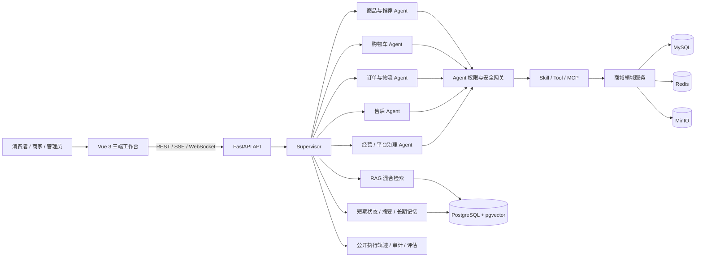

# Ecom AI

> 面向消费者、商家和平台管理员的全链路智能商城。它不只是一个“商城页面 + 聊天框”，而是把商品、购物车、订单、物流、售后、店铺经营和平台治理接入可执行、可确认、可审计的 Agent 系统。


## 项目简介

Ecom AI 是一个 Vue 3 + FastAPI 构建的企业级在线商城实践项目，覆盖消费者、商家、平台管理员三套独立工作台，并围绕真实业务数据设计了四类 AI 角色：消费者专属客服、店铺 AI 客服、商家 AI 经营助理和平台 AI 管家。

项目重点不是让模型“自由操作数据库”，而是让 Agent 在经过身份、租户、业务状态和权限校验后，通过受控 Skill / Tool / MCP 能力读取实时数据、生成结构化卡片，并在执行退款申请、库存调整、治理操作等写操作前展示确认信息。开发者可以在消息页右栏查看计划、领域 Agent 委派、工具调用、知识检索、记忆使用和结果校验等公开执行轨迹。

当前仓库适合用于本地完整演示、Agent 应用工程实践和二次开发；支付、物流等外部系统使用本地模拟能力，不应直接视为已经完成生产商用接入。

## 核心亮点

- **三端完整业务闭环**：消费者购买与售后、商家经营与客服、管理员治理与 AI 配置均有独立界面和权限边界。
- **Supervisor + 领域 Agent**：根据用户目标动态规划，按商品、购物车、订单、物流、售后、账户、经营分析和平台治理等业务域委派，不把复杂请求硬编码成单一固定 Workflow。
- **结构化而非文字墙**：Agent 可返回商品卡、订单卡、物流卡、购物车卡、地址卡、经营指标卡和操作确认卡，卡片可在聊天内弹窗查看。
- **真实业务数据驱动**：关键事实通过授权工具实时查询；商品详情图片支持 OCR，结构化商品资料与知识库检索共同为回答提供依据。
- **受控写操作**：工具白名单、闭合输入 Schema、RBAC、用户/店铺数据域隔离、服务端参数重建、幂等、版本校验和二次确认共同约束 Agent。
- **上下文与记忆管理**：类型化会话状态区分当前焦点、候选列表、待确认操作和卡片集合，结合滚动摘要与长期偏好记忆支持连续追问。
- **人工接管**：AI 可识别转人工意图，保留已有上下文供店铺或平台客服继续处理，人工结束后再交还 AI。
- **可观测与可评估**：记录模型、Agent、工具、RAG、记忆、审批和降级链路；提供固定数据集评估、Agent 安全测试和真实浏览器验收入口。

## 三端角色与能力

| 使用者 | 主要工作台 | 核心业务 | AI 角色 |
| --- | --- | --- | --- |
| 消费者 | 商城首页、商品详情、购物车、订单、消息、个人中心 | 搜索与选购、模拟支付、物流、评价、售后、收藏和地址管理 | 专属客服负责跨店服务；店铺 AI 客服负责当前店铺商品与本店订单 |
| 商家 | 商品、SKU/库存、订单、售后、评价、店铺资料、消息 | 商品上架与编辑、订单履约、顾客服务、经营数据查看 | AI 经营助理分析经营状态、商品与库存、订单和售后待办 |
| 平台管理员 | 仪表盘、用户与店铺、客服、AI 管理、知识库、评估与观测 | 用户/店铺治理、业务审计、Agent/Skill/MCP/RAG 配置 | AI 管家汇总平台风险与待办，并通过受控工具协助治理 |

## 真实产品界面

以下图片均来自本仓库在本机 Docker 环境中的真实运行页面，不是设计稿或静态 Mockup。演示数据仅用于展示功能。

### 1. 消费者商城

首页以推荐商品为主入口，支持进入商品、店铺、收藏、购物车、订单和消息中心。


商品详情页把图片与详情放在左侧，把 SKU 缩略图、价格、库存、数量、总额和购买操作集中在右侧；立即购买以弹窗方式完成结算，避免打断浏览位置。


购物车按店铺组织商品，展示商品缩略图、款式、单价、数量和结算汇总；订单中心按状态筛选，并提供物流、评价、售后和确认收货等上下文操作。

| 购物车 | 订单中心 |
| --- | --- |
|  |  |

### 2. 消费者专属客服

消费者消息中心采用三栏布局：左侧会话，中间为微信式消息和结构化业务卡片，右侧为可审计执行轨迹。下图中的一次真实对话同时返回了物流卡和平台规则卡，Supervisor 将多目标请求拆分后交给不同领域能力，再汇总为用户可操作的结果。


### 3. 商家工作台与 AI 经营助理

商家可以在可视化商品卡列表中新增、编辑、下架或删除商品；编辑页围绕消费者看到的商品详情布局进行所见即所得式管理，并支持图片上传、剪贴板粘贴、OCR、SKU 价格与库存、商品参数、详情内容和常见问题。


AI 经营助理面向经营人员返回收入、订单、售后、库存和商品等业务卡片，并在右侧展示公开执行轨迹。普通顾客会话与 AI 经营助理会话相互独立。


### 4. 平台管理与 AI 管家

平台仪表盘统一呈现用户、店铺、商品、客服待办和 AI 服务状态；左侧提供 Agent、Skill、MCP Tool、权限策略、知识库和评估等治理入口。


AI 管家可针对平台待办、失败任务和治理对象返回结构化卡片，并展示计划、委派、工具和校验轨迹。截图保留了一次真实的死信治理查询，用于体现异常并不会被“包装成成功”。


## Agent 如何工作



一次复杂请求通常经过以下过程：

1. Supervisor 识别用户目标、业务对象和授权范围，并判断是否需要澄清。
2. 只读任务可以并行委派给领域 Agent；写操作保持串行并绑定最新业务版本。
3. 领域 Agent 只获得完成当前任务所需的 Skill 和工具说明，工具参数由服务端结合登录身份重建。
4. RAG 使用关键词与向量混合检索，并根据平台、店铺、商品、发布版本和权限标签过滤结果。
5. Supervisor 校验子任务结果；数据冲突、超时或来源不足时要求返工、降级或明确拒答。
6. 结果以文字与结构化卡片返回；有副作用的操作必须经过确认卡后才会执行。
7. 计划、委派、工具、知识检索、记忆、确认和结果摘要写入可观测链路。模型的私有隐藏推理不会作为业务事实使用或展示。

## 技术架构

| 层级 | 技术与职责 |
| --- | --- |
| 前端 | Vue 3、TypeScript、Vite、Pinia、Vue Router、Vitest、Playwright |
| API | Python 3.13、FastAPI、Pydantic、SQLAlchemy Async、Alembic |
| Agent | Supervisor、领域 Agent、Skill、Tool/MCP、审批、人工接管、SSE 流式响应 |
| 业务主库 | MySQL 8.4，保存用户、店铺、商品、订单、支付、物流、售后、消息和审计数据 |
| AI 数据 | PostgreSQL + pgvector，保存知识切片、向量、检索日志、会话摘要、记忆与运行状态 |
| 缓存与事件 | Redis，承担缓存、会话、限流、在线状态、未读计数和 Streams 事件流 |
| 文件 | MinIO S3 兼容对象存储 + ClamAV 文件扫描 + OCR 处理 |
| 可观测性 | OpenTelemetry；可选启动 Prometheus、Grafana、Tempo 和 Loki |
| 部署 | Docker Compose，多容器 API、前端、基础设施和专用 Worker |

## 快速开始

### 1. 环境要求

- macOS / Linux（Windows 建议使用 WSL2）
- Docker Desktop
- Conda
- Node.js 24
- pnpm 11

### 2. 创建环境并安装依赖

```bash
# 克隆公开仓库并进入项目目录。
git clone https://github.com/szlstart/ecom_ai.git
cd ecom_ai

# 按 environment.yml 创建 Python 3.13 环境；已经创建过可跳过。
conda env create -f environment.yml

# 激活项目环境。
conda activate ecom-ai

# 从安全模板创建本地配置；真实密钥只能写入 .env，不能提交到 Git。
cp .env.example .env

# 同步 Conda 环境、生成锁定依赖并安装后端与前端依赖。
make bootstrap
```

### 3. 初始化并启动完整应用

```bash
# 先启动数据库、缓存、对象存储和文件扫描服务。
make infra-up

# 初始化或升级 MySQL 与 PostgreSQL 数据结构。
make migrate

# 写入本地开发所需的基础数据；命令可重复执行。
make seed

# 构建并启动 API、前端和全部后台 Worker。
make app-up

# 查看全部容器的健康状态。
docker compose ps
```

访问地址：

| 服务 | 地址 |
| --- | --- |
| 消费者商城 | <http://127.0.0.1:8080/> |
| 商家中心 | <http://127.0.0.1:8080/merchant> |
| 平台管理端 | <http://127.0.0.1:8080/admin/login> |
| FastAPI OpenAPI | <http://127.0.0.1:8000/docs> |
| API 就绪检查 | <http://127.0.0.1:8000/health/ready> |
| MinIO 控制台 | <http://127.0.0.1:19001> |

### 4. 创建商家和管理员账号

```bash
# 创建平台管理员；命令会交互式要求输入密码和安全信息。
make admin-bootstrap USERNAME=your_admin_name

# 创建一个店铺及其运营账号；密码同样在终端中交互输入。
make merchant-bootstrap USERNAME=your_merchant_name STORE_NAME="你的店铺名称"
```

消费者可直接在商城导航栏的“注册/登录”弹窗中完成注册。请勿把演示账号、密码、TOTP Secret、恢复码或模型密钥写进 README。

### 5. 配置模型与向量检索

`.env.example` 只保存变量名和非敏感默认值。要启用真实模型，请在本地 `.env` 中配置兼容接口：

```dotenv
# OpenAI-compatible Agent 模型服务。
ECOM_AGENT_MODEL_REQUIRED=true
ECOM_AGENT_MODEL_API_URL=https://your-provider.example/v1
ECOM_AGENT_MODEL_API_KEY=replace-with-your-secret
ECOM_AGENT_MODEL_NAME=your-model-name
ECOM_AGENT_MODEL_WIRE_API=responses

# OpenAI-compatible Embedding 服务；维度必须与所选模型和数据库索引一致。
ECOM_EMBEDDING_API_URL=https://your-embedding-provider.example/v1
ECOM_EMBEDDING_API_KEY=replace-with-your-secret
ECOM_EMBEDDING_MODEL=your-embedding-model
ECOM_EMBEDDING_DIMENSION=768
```

如果模型或 Embedding Provider 未配置、超时或不可用，系统会进入明确的降级路径，不会伪造模型或向量检索结果。

## 详细使用指南

完整的消费者购买流程、商家经营流程、平台治理流程、Agent 演示问题、配置说明和常见故障处理，请阅读：

**[产品使用与演示指南](docs/PRODUCT_GUIDE.md)**

## 质量验证

```bash
# 校验权限、状态、错误码等 Registry 是否一致。
make registry-check

# 执行后端 Ruff / mypy 与前端 TypeScript 类型检查。
make lint

# 执行后端 pytest 和前端 Vitest。
make test

# 生成 OpenAPI 与 TypeScript 客户端，并完成完整本地检查。
make check

# 在隔离的数据命名空间中执行迁移、集成、Agent 安全、评估和浏览器验收。
make acceptance-test-isolated
```

`make acceptance-test-isolated` 是发布前推荐入口，会创建并清理独立测试数据库、缓存和对象存储命名空间。单项测试通过不等于整个系统已经达到生产发布条件；部署前还应完成 Secret 管理、第三方支付/物流接入、容量压测、备份恢复演练和安全评审。

## 项目目录

```text
ecom-ai/
├── backend/                 # FastAPI、领域服务、Agent Runtime、Worker、迁移与测试
├── frontend/                # Vue 3 三端前端、组件测试与 Playwright 用例
├── knowledge/               # 平台规则等知识源文件
├── docs/                    # OpenAPI、运行手册、验收资料、产品指南和截图
├── eval/                    # 评估材料
├── observability/           # Grafana 等可观测配置
├── scripts/                 # 构建、验收、备份、性能、安全和发布脚本
├── compose.yaml             # 本地完整容器编排
├── Makefile                 # 统一开发、测试与运维入口
└── .env.example             # 无 Secret 的配置模板
```

## 数据与安全说明

- `.env`、真实 API Key、账号密码、个人信息、对象存储文件和本地数据库不得提交到 Git。
- 截图中的商品、订单、轨迹和指标属于本地演示数据，不代表真实交易或线上经营结果。
- 本地支付和物流流程用于验证订单状态、资金流与 Agent 交互，正式上线前必须替换为合规的支付、物流和通知服务。
- 管理员权限很高，但仍通过服务端授权、数据范围、状态机、审计和确认机制约束，不依赖 Prompt 自觉。
- 对外发布前请执行仓库 Secret 扫描，并复核暂存区中是否包含用户数据或运行产物。

## License

本仓库当前未附带开源许可证。未经仓库所有者明确授权，不代表允许复制、修改或商业使用。
